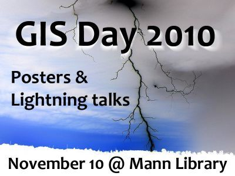

# GIS Day 2010

Wednesday, November 10, 2010 \
Mann Library 102

GIS Day is held each November during Geography Awareness Week, with events in more than 80 countries. Local events in Ithaca are organized by members of SynerGIS, a group of GIS professionals, managers, and students from Cornell, Tompkins County, and the surrounding area.

## Schedule of events

- 12:00 to 3:00 : Open house and posters
- 12:30 : Lightning Talks, wave one
- 1:30 : Lightning Talks, wave two

### Lightning Talks

GIS Day 2010 featured two series of short, 5-minute presentations given by folks from across several Cornell departments and local governments, each sharing a bit of what they are doing with Geographic Information Systems (GIS).

List of lightning talks:

- Stephen DeGloria : [Environmental Information Science at Cornell: Research, Teaching, and Extension](slides/DeGloria.pdf)
- Sutee Anantsuksomsri : [Spatial Analysis on the Impacts of Mass Transit Improvements on Residential Land Values in the Bangkok Metropolitan Region](slides/Anantsuksomsri.pdf)
- Mark Whitmore : [Ash Borer](slides/Whitmore.pdf)
- Chris Morrissey : [City Facilities Inventory Project](slides/Morrissey.pdf)
- Nij Tontisirin : [Spatial Analysis of Residential Choices in the Bangkok Metropolitan Region](slides/Tontisirin.pdf)
- Scarlett Zuo : [IRS County-to-County Migration Within New York State](slides/Zuo.pdf)
- Boris Michev : [In Support of the Curriculum: Mapping Steinbeck's Grapes of Wrath](http://maps.google.com/maps/ms?hl=en&ie=UTF8&msa=0&msid=102659333711930112235.00046f4e4cdc70ac33e16&ll=38.134557,-96.569824&spn=7.756811,14.084473&z=6)
- Keith Jenkins : LiDAR data
- Steven Vanek : [Soil nutrient management in Bolivia](slides/Vanek.pdf)
- John Sipple : [NYS Center for Rural Schools](https://www.nyruralschools.org/)
- Steve Smith : [ArcGIS Engine: Building and Deploying Custom GIS and Mapping Applications](slides/Smith.pdf)
- Diane Ayers : [Generating KML from ArcGIS](slides/Ayers.pdf)
- Jan Vink : [Census 2010 Count Review experience](slides/Vink.pdf)
- Dana Goldense : [Immigrants and services in Arizona](slides/Goldense.pdf)
- David Patel : [Mapping the Rise and Fall of Social Orders in Post-invasion Iraq](slides/Patel.pdf)

### Open House and Posters

Before, between, and after the lightning talks, an open house provided an opportunity for presenters and audience members to mix and mingle, viewing posters, and seeking out that person who gave that great lightning talk earlier, to ask questions and learn more.

List of posters:

- Leslie L Allee: Lady Bug project (4-H) - Citizen Science
- Diane Ayers: Adding New York Agricultural Districts to Google Earth
- Stephen DeGloria: Mapping Soil Potassium Supplying Power in New York State Using Soil Geographic Databases
- Stephen DeGloria: [Geospatial Science and Technology Instruction at Cornell](slides/GIS-courses.pdf)
- Sue Hoskins: GIS Education for 4-H
- Boris Michev: Mapping Steinbeck's Grapes of Wrath
- Andrew Roe: Examining Forest Parcelization Patterns in Eastern New York
- Matt Tiegel: Eco-Friendly Sign Inventory
